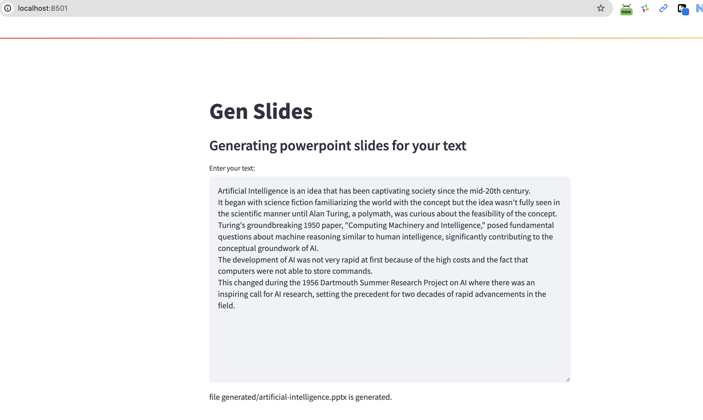
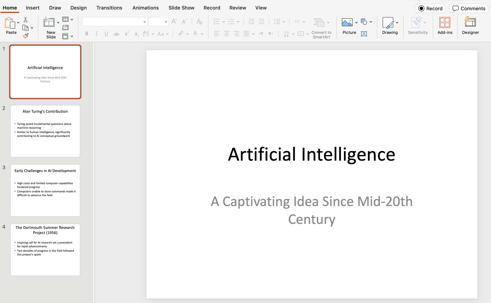

# Gen Slide
Generating PowerPoint slides extracted from a text.

## How to run

### Set up 
Clone the repo: 
```commandline
git clone http://github.com/mehdimo/GenSlide

cd GenSlide
```

then, create a virtual environment and install packages.
```commandline
python -m venv ./venv
. ./venv/bin/activate

pip install -r requirements.txt
```
* Note: Use a Python != 3.9.7 for virtualenv. `streamlit` won't work in that version. The version here is `3.12`. 
* We used `gpt4ll` package to run a LLM server on a local machine. To learn more about gpt4all, see [here](https://docs.gpt4all.io/).

### RUN LLM Service
1. Go to `llm-service` folder and run the `gpt.py` file.
```commandline
cd llm-service
python gpt.py
```
* Running for the first time, the LLM model will be downloaded which may take several minutes.

### RUN UI
Navigate to `fronend` folder and run `ui.py` using streamlit command:
```commandline
cd .. 
cd frontend
streamlit run ui.py
```
It will open the UI in the browser. 

### Generate PowerPoint slides
* In the UI's textbox, write the text that you want to create presentation based on it. You may use the text in file `content.txt` in `data` folder.
* The generated `.pptx` file will be stored in the `frontend/generated` folder.

User Interface:


Generated slides in PowerPoint:

